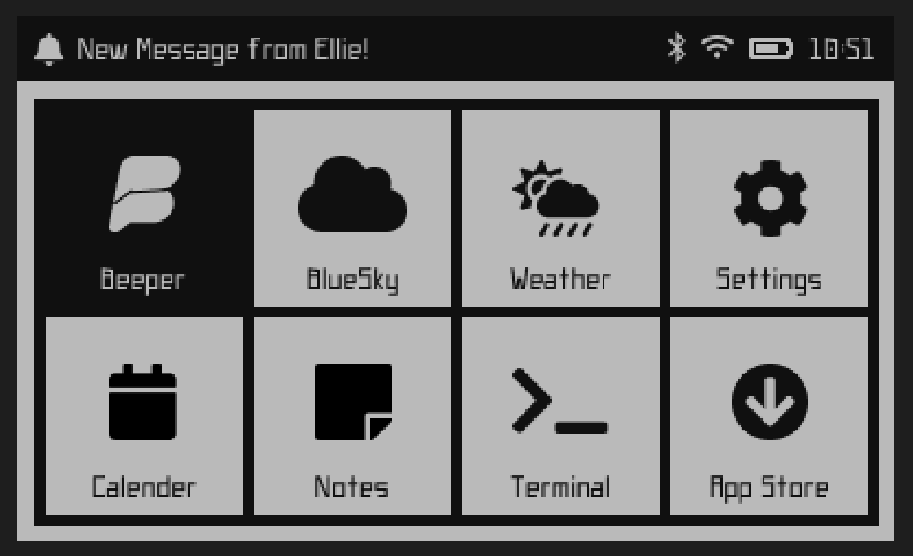

# BebbleBerry
A BeepBerry Launcher and UI Framework using a PebbleUI-esc design. 

There are two main goals for this project:
- First, to make a user friendly interface so ANYONE can use a beeperberry.
- Second, make a launcher that any developer can build their own apps. Ideally I would love to see a future app store created for easy installation. 

## Mockups

### Main Menu

## Planned Features
- Beeper Integration
- Push Notification System
- Support for vibration motors
- GUI for connecting to WiFi
- Battery Monitoring
- Easy to use app like launcher

## More Feature Ideas
- Camera Support
- Bluetooth speaker and headphone support
- App store

## Apps Planned
- Weather
- Beeper
- Notes
- Settings
- Terminal
- Calender

## More App ideas
- Email Client
- Music player
- Camera App
